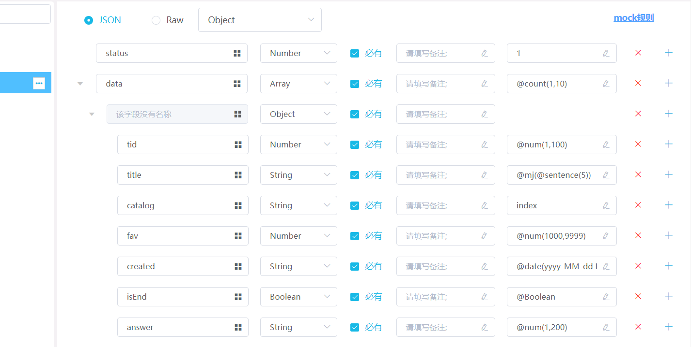
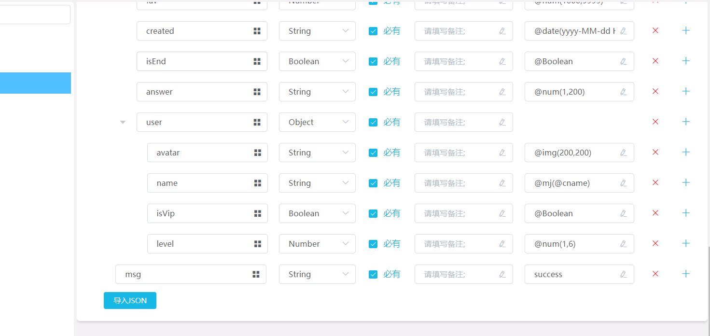
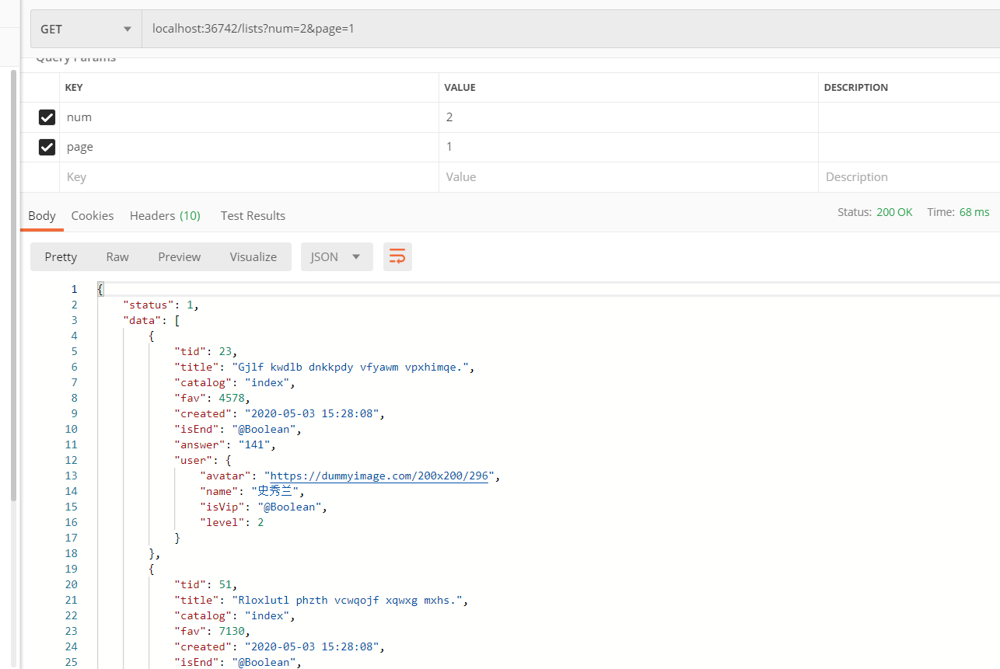

#### 本小节练习使用mock数据开发
- 使用mock.js轻量化实现mock数据开发，见`jquery-mock.html`;
  暂未实现页码/翻页

- 模块化实现mock数据开发，见`vue-mock`;

- 使用云端DOClever实现mock数据开发，见`doclever-mock.html`;
[文档参考](http://doclever.cn/controller/read/read.html#5a532f98b7731a2ba86093b3)

由于在本地发送请求遇到同源限制，一时间未顺利解决，在此贴下DOClever中的接口配置，以及postman测试结果的截图:
- DOClever

- postman

